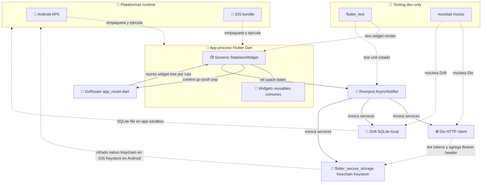
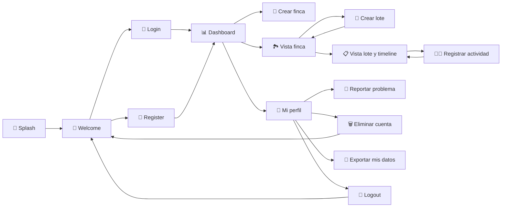
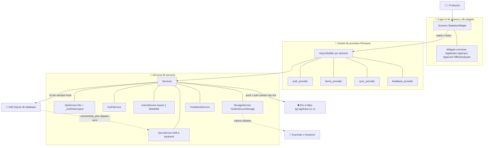
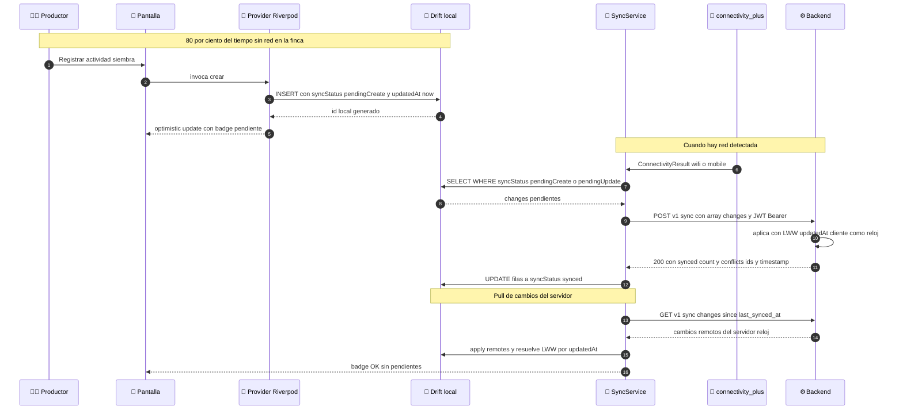
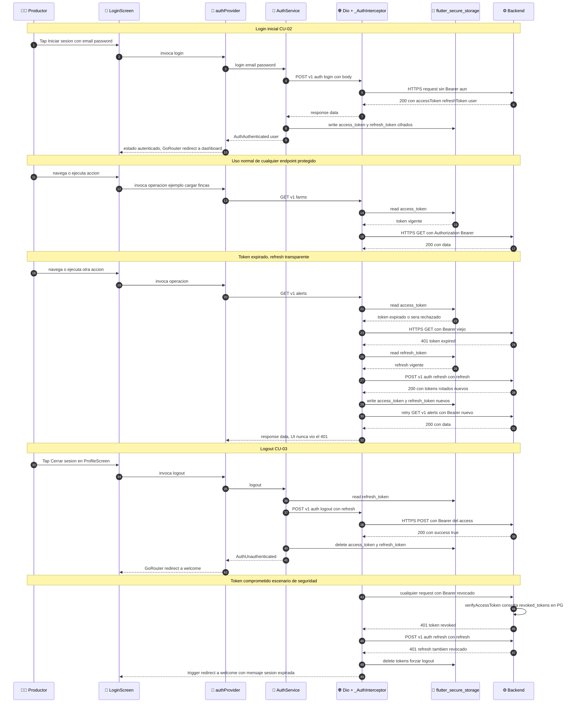
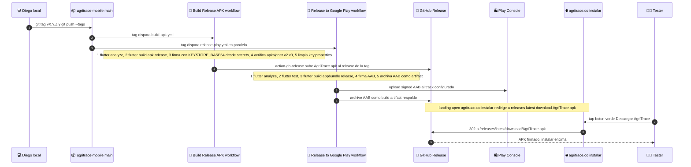

# agritrace-mobile

App móvil del MVP de **AgriTrace** — plataforma de trazabilidad agrícola para pequeños y medianos productores en Colombia.

> Estrategia MVP: **Farmer-First · Mobile-Only · Offline-First**. El agricultor registra actividades sin conexión durante 14+ días. Marketplace con compradores internacionales es later release.
>
> **Validación comercial MVP**: Valle del Cauca, modelo híbrido Mes 1 gratis + $29.990 COP/mes Mes 2. Demo navegable: [`agritrace-demo`](https://github.com/diegotrujillor/agritrace-demo). Estrategia: [`agritrace-docs/01-preparacion-mvp/10-comercial-gtm/`](https://github.com/diegotrujillor/agritrace-docs/tree/main/01-preparacion-mvp/10-comercial-gtm).

## Stack Técnico

| Capa | Tecnología |
|------|------------|
| Framework | Flutter 3.x |
| Lenguaje | Dart |
| Almacenamiento local | Drift (SQLite offline-first) |
| Estado | Riverpod |
| Navegación | GoRouter |
| HTTP | Dio |
| Almacenamiento seguro | flutter_secure_storage |
| Testing | flutter_test + mocktail |
| Plataformas | iOS + Android |

### Cómo interactúan las 9 capas

Cada componente de la tabla de arriba conectado con los demás, con el rol concreto que cumple en runtime.



### Rol de cada capa

| Capa de la tabla | Rol concreto en runtime | Vive en `lib/` |
|------------------|--------------------------|----------------|
| Flutter 3.x + Dart | El proceso entero. Render declarativo del widget tree. | todo `lib/` |
| Drift SQLite | Source of truth local; UI siempre lee de aquí. Sync envía cambios al backend en background. | `lib/database/` |
| Riverpod | Pega screens con services. Mantiene 3 estados loading data error en cada `AsyncNotifier`. | `lib/providers/` |
| GoRouter | Mapea URLs a widget trees + ejecuta auth redirect en cada navegación. | `lib/navigation/` |
| Dio | Cliente HTTP único. `_AuthInterceptor` agrega Bearer y refresca tokens en 401. | `lib/services/api_service.dart` |
| flutter_secure_storage | Único lugar autorizado para guardar access y refresh token; usa Keychain en iOS, Keystore en Android. | `lib/services/storage_service.dart` |
| flutter_test + mocktail | Solo en `test/`. mocktail produce dobles para Dio y Drift; tests cubren providers + widgets críticos. | `test/unit/`, `test/widget/` |
| iOS + Android | Targets de build. Una codebase Dart, dos binarios firmados. | `android/`, `ios/` |

> Foto-instantánea: los tokens nunca dejan `flutter_secure_storage`. Si la APK es decompilada, el atacante NO obtiene credenciales de GitHub ni del backend. El backend valida cada request con JWT firmado HS256.

## Pantallas MVP (10 pantallas — Flujo Productor)

| # | Pantalla | Sprint |
|---|----------|--------|
| 1 | Bienvenida | 1 |
| 2 | Registro | 1 |
| 3 | Login | 1 |
| 4 | Dashboard vacío | 1 |
| 5 | Dashboard con fincas | 2 |
| 6 | Registrar finca | 2 |
| 7 | Vista finca | 2 |
| 8 | Registrar lote | 2 |
| 9 | **Vista lote + timeline actividades** ⭐ | 3 |
| 10 | **Registrar actividad** ⭐ | 3 |

> Pantallas later release (Generar QR, Trazabilidad pública) diferidas hasta validar demanda con compradores.

## Flujo de Navegación



> GoRouter implementa este grafo en `lib/navigation/app_router.dart`. El redirect de auth fuerza `/welcome` para usuarios no autenticados y `/dashboard` para los autenticados; las pantallas con asterisco están condicionadas a tener sesión activa.

## Estructura del Proyecto

```
agritrace-mobile/
├── lib/
│   ├── screens/
│   │   ├── auth/          # welcome, login, register
│   │   ├── farms/         # dashboard, farm_form, farm_detail
│   │   ├── plots/         # plot_form, plot_detail
│   │   └── activities/    # activity_form, activity_timeline
│   ├── widgets/
│   │   ├── common/        # AppButton, AppInput, AppCard, OfflineIndicator
│   │   └── domain/        # FarmCard, ActivityListItem
│   ├── navigation/        # GoRouter setup, route names
│   ├── services/
│   │   ├── api_service.dart
│   │   ├── auth_service.dart
│   │   ├── sync_service.dart   # Sync Drift ↔ backend
│   │   └── storage_service.dart
│   ├── database/
│   │   ├── database.dart       # Drift DB init
│   │   ├── models/             # Farm, Plot, Activity (modelos locales)
│   │   └── migrations/
│   ├── providers/              # Riverpod providers por dominio
│   │   ├── auth_provider.dart
│   │   ├── farms_provider.dart
│   │   └── sync_provider.dart
│   ├── utils/                  # validators, formatters, constants
│   └── main.dart
├── test/
│   ├── unit/
│   └── widget/
├── pubspec.yaml
└── README.md
```

## Diagramas internos

Vista funcional + sincronización local-remoto. Para el stack completo (Cloudflare, Caddy, backend, Postgres, Object Storage) ver [`agritrace-docs/01-preparacion-mvp/06-infraestructura/README.md → Diagrama del Stack`](https://github.com/diegotrujillor/agritrace-docs/blob/main/01-preparacion-mvp/06-infraestructura/README.md#diagrama-del-stack--vista-funcional).

### Arquitectura por capas (UI a base de datos local)

Riverpod media entre las pantallas y los servicios. La UI **siempre** lee de Drift (source of truth local); el sync con backend ocurre en background.



**Reglas no negociables** (ver [`CLAUDE.md`](CLAUDE.md)):

| Capa | Recibe | Devuelve | No puede |
|------|--------|----------|----------|
| Screen widget | rutas + provider watch | UI declarativa | tener lógica de negocio |
| Provider AsyncNotifier | inputs del usuario | estado loading data error | tocar Drift directo desde build |
| Service | tipos del dominio | tipos del dominio o throw | depender de Flutter widgets |
| Drift DB | SQL tipado | rows | exponerse fuera de services |
| Dio ApiService | DTOs | envelope success data | bypass del _AuthInterceptor |

### Flujo de sincronización (offline-first)

Qué pasa cuando el productor registra una actividad sin red y luego recupera conexión. Garantía MVP: 14 días offline sin pérdida.



> Detalle del protocolo: [`CLAUDE.md → Sync protocol`](CLAUDE.md). Casos de uso afectados: CU-22 (trabajar offline), CU-23 (reconectar y sincronizar), CU-24 (LWW conflict resolution) en [`agritrace-docs/01-preparacion-mvp/03-mapeo-funcional/casos-de-uso/`](https://github.com/diegotrujillor/agritrace-docs/tree/main/01-preparacion-mvp/03-mapeo-funcional/casos-de-uso).

### Flujo de autenticación (vista cliente)

Ciclo completo desde tap inicial hasta refresh automático en 401. Complementa el server-side flow del backend en [`agritrace-backend/README.md → Flujo de autenticación`](https://github.com/diegotrujillor/agritrace-backend/blob/main/README.md#flujo-de-autenticación-jwt-access--refresh).



**Garantías de seguridad cliente-side:**

| Aspecto | Cómo lo cumple el app |
|---------|------------------------|
| Tokens nunca en plain storage | `flutter_secure_storage` usa **Keychain en iOS** (Secure Enclave cuando hay TouchID/FaceID) y **Keystore en Android** (StrongBox cuando hay hardware). Single source de truth. |
| Refresh transparente al usuario | `_AuthInterceptor` (`api_service.dart`) intercepta cualquier 401, refresca, reintenta. La UI nunca ve el 401 si el refresh es vigente. |
| Concurrencia segura | El interceptor tiene un single-flight lock: si 5 requests fallan a la vez con 401, sólo 1 dispara el refresh; las otras 4 esperan al nuevo token. Evita refresh-storm + tokens divergentes. |
| Logout limpio | `AuthService.logout` borra ambos tokens del Keychain/Keystore antes de redirigir. Imposible reusar la sesión post-logout. |
| Refresh comprometido | Si el backend invalida también el refresh (`401` en `/auth/refresh`), el interceptor borra ambos tokens y dispara redirect a `/welcome`. No retry loop infinito. |
| API base configurable | `--dart-define=API_BASE_URL=...` en build time. El APK release apunta a `https://api.agritrace.co/v1`; debug builds pueden apuntar a localhost. |

> CU-01 (registro), CU-02 (login), CU-03 (logout) están en [`agritrace-docs/01-preparacion-mvp/03-mapeo-funcional/casos-de-uso/`](https://github.com/diegotrujillor/agritrace-docs/tree/main/01-preparacion-mvp/03-mapeo-funcional/casos-de-uso). La implementación vive en `lib/services/auth_service.dart`, `lib/services/api_service.dart` (interceptor), `lib/providers/auth_provider.dart`.

## Sistema de Diseño

```dart
// Colores
const primaryGreen  = Color(0xFF2D7A3E);
const darkGreen     = Color(0xFF1B5028);
const lightGreen    = Color(0xFFE8F5E9);
const earthBrown    = Color(0xFF6D4C3D);
const harvestYellow = Color(0xFFF9A825);
const certBlue      = Color(0xFF1976D2);

// Tipografía: Inter (Google Fonts) — mínimo 16px body, touch targets ≥44px
// Espaciado base 8px: xs=4 · sm=8 · md=16 · lg=24 · xl=32
// Dimensiones mobile-only: 375 × 812 px
```

## Setup Local

### Prerequisitos
- Flutter SDK 3.x (`flutter --version`)
- Android Studio o Xcode
- Emulador o dispositivo físico
- **[agritrace-backend](https://github.com/diegotrujillor/agritrace-backend) corriendo en `localhost:3000`** — el login y la sincronización requieren la API. Levanta el backend primero.

### 1. Clonar y configurar

```bash
git clone https://github.com/diegotrujillor/agritrace-mobile.git
cd agritrace-mobile
flutter pub get
```

### 2. Ejecutar

La configuración se pasa por `--dart-define` (no hay archivo `.env`):

```bash
flutter run --dart-define=API_BASE_URL=http://10.0.2.2:3000/v1   # emulador Android → localhost
flutter run --dart-define=API_BASE_URL=http://localhost:3000/v1   # simulador iOS
```

## Variables de configuración

Se inyectan en build/run vía `--dart-define` (default en código: `http://10.0.2.2:3000/v1`):

| Variable | Ejemplo | Uso |
|----------|---------|-----|
| `API_BASE_URL` | `https://api.agritrace.co/v1` | Backend del piloto (dispositivo real) |
| `API_BASE_URL` | `http://10.0.2.2:3000/v1` | Emulador Android → backend local |

## Build distribuible (APK Android, piloto)

Requiere Android SDK (`ANDROID_HOME`). Firma release vía
`android/key.properties` + keystore (ambos git-ignored — ver
"Firma / keystore" abajo).

```bash
flutter build apk --release --dart-define=API_BASE_URL=https://api.agritrace.co/v1
# salida: build/app/outputs/flutter-apk/app-release.apk  (instalación directa / sideload)
```

### Firma / keystore (secreto — NO se versiona)

`android/agritrace-release.keystore` + `android/key.properties` están en
`.gitignore`. Para reconstruir en otra máquina/CI: generar con
`keytool -genkeypair -keystore agritrace-release.keystore -alias agritrace
-keyalg RSA -keysize 2048 -validity 10000` y crear `android/key.properties`
con `storePassword/keyPassword/keyAlias=agritrace/storeFile=agritrace-release.keystore`.
**Resguardar keystore + passwords en gestor de contraseñas** — perderlo
impide publicar actualizaciones de la app.

### Pipeline de release (de git tag a tester)

Un `git tag vX.Y.Z` dispara dos workflows en paralelo: uno para el APK de side-load (canal del piloto) y otro para el AAB del Play Console (canal post-pilot).



**Características:**

| Aspecto | Cómo lo implementamos |
|---------|------------------------|
| Trigger | Solo `git tag vX.Y.Z + git push --tags`. Push a `main` sin tag **no** dispara release. |
| Secreto del keystore | `KEYSTORE_BASE64` en GitHub Actions Secrets. Se decodifica al filesystem del runner, se usa, se borra antes del cleanup step. |
| Verificación de firma | `apksigner verify --verbose --print-certs` confirma v2 + v3 schemes. Falla el job si no firma correctamente. |
| Canal de distribución actual | GitHub Release APK descargada desde `agritrace.co/#instalar` (mientras Play Internal testing no esté listo). |
| Canal post-pilot | Play Console internal testing → closed alpha → producción. Build pipeline ya emite el AAB hoy aunque el track Play sea no-op hasta que se complete `PLAY_CONSOLE_SETUP.md`. |
| Rollback de APK | Tester re-descarga la tag anterior desde GitHub Releases e instala encima. **No pierde datos** (Drift SQLite local persiste; mismo certificado de firma). |
| Idempotencia | Re-ejecutar el mismo tag falla en el upload (action-gh-release rechaza tag existente). Bump de patch obligado. |

## Offline-First

El app usa **Drift** como base de datos local (SQLite):
- Todos los datos se guardan localmente primero
- `sync_service` sincroniza con el backend al recuperar conexión (`POST /v1/sync`)
- `OfflineIndicator` muestra estado de conexión en tiempo real
- Garantía: **14+ días sin conexión** sin pérdida de datos

## Testing

```bash
flutter test                  # Todos los tests
flutter test --coverage       # Coverage report (objetivo: 80%+)
flutter test test/unit/
flutter test test/widget/
```

## Referencia de Implementación

| Artefacto | Ubicación |
|-----------|-----------|
| Prototipo React navegable | [`agritrace-prototype › agritrace_prototype.jsx`](https://github.com/diegotrujillor/agritrace-prototype/blob/main/agritrace_prototype.jsx) |
| Código Flutter de referencia | [`agritrace-prototype › agritrace_flutter_main.dart`](https://github.com/diegotrujillor/agritrace-prototype/blob/main/agritrace_flutter_main.dart) |
| Especificaciones de pantallas | [`agritrace-docs › 04-diseno-ui-ux`](https://github.com/diegotrujillor/agritrace-docs/tree/main/01-preparacion-mvp/04-diseno-ui-ux) |
| Scope MVP | [`agritrace-docs › 09-scope-mvp.md`](https://github.com/diegotrujillor/agritrace-docs/blob/main/01-preparacion-mvp/09-scope-mvp.md) |

## Repositorios Relacionados

| Repo | Descripción |
|------|-------------|
| [`agritrace-docs`](https://github.com/diegotrujillor/agritrace-docs) | Documentación técnica, DB schema, API spec, UI/UX |
| [`agritrace-backend`](https://github.com/diegotrujillor/agritrace-backend) | Node.js + TypeScript API REST |
| [`agritrace-prototype`](https://github.com/diegotrujillor/agritrace-prototype) | Prototipo React navegable + código Flutter de referencia |

---

*AgriTrace — Trazabilidad que conecta · MVP · Mayo 2026*

---

## Licencia

**Copyright © 2025–2026 Diego Trujillo R.**

Este proyecto está publicado bajo **MIT + Commons Clause**:

- ✅ Puedes estudiar, modificar y redistribuir el código para uso personal o no comercial
- ✅ Puedes contribuir mejoras (pull requests bienvenidos)
- ❌ **No puedes vender** este software ni ofrecer servicios comerciales basados en él sin autorización expresa del autor

Ver [`LICENSE`](LICENSE) para el texto completo.  
Uso comercial → [diegotrujillor@gmail.com](mailto:diegotrujillor@gmail.com)
